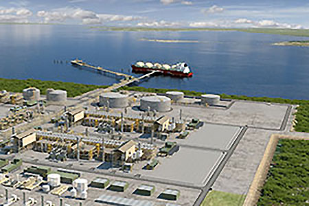

# Fin-Fan Early Warning System
## Jim Bentley

### Introduction
A fin-fan is a type of heat exchanger that forces air over a set of coils to cool the process. It is also referred to as an air cooled heat exchanger. Fin-fan heat exchangers are generally used where a process system generates heat which must be removed, but for which there is no local use.

My current employer, an Oil and Gas producer, utilises many fin-fan systems in the production of liquified natural gas.  

This project will use a machine learning model to predict future failure of a system and provide an early warning system to production staff.

### Design
The application will consist of the following technology:
1. PSQL (AWS) - History Database to mimic a plant historian.  This data will be used for the ML model.
2. Google Colab with Spark - will be used to create the ML model.
3. AWS Bucket - to save and store the ML model.
4. Flask web app hosted on Heroku or AWS.
5. Interactive Web site to display results and provide an early to production staff. 

